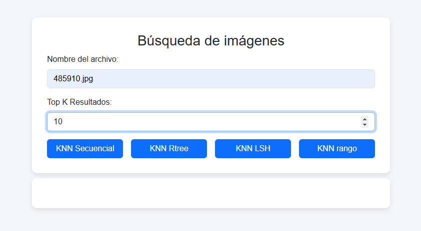

# Proyecto Final
## Introducción
Para el desarrollo de este proyecto se tendrá en cuenta la integración del Proyecto 2 y Proyecto 3 en uno solo al momento de la documentación respectiva.
### Objetivo del proyecto
Este proyecto está enfocado en entender y aplicar los algoritmos de búsqueda y recuperación de información basada en el contenido.

### Descripción del dataset
Se trabajó con 2 bases de datos obtenidas de Kaggle, adjuntas con sus links respectivos:
- Anime Faces : https://www.kaggle.com/datasets/subinium/highresolution-anime-face-dataset-512x512
  - El dataset contiene más de 300k fotografías cargadas en alta resolución almacenadas en una carpeta llamada 'portraits' de 512 px (con recortes de retrato, filtrado mejorado a través de solo y clasificación de discriminadores para limpieza) disponible para descargar a través de rsync (16 GB, n = 302 652)
- Mangas Data : https://www.kaggle.com/datasets/victorsoeiro/manga-manhwa-and-manhua-dataset
  - Este dataset contiene más de 70 000 manga, manhwa y manhua únicos con 6 columnas que contienen información de : tittle (nombre completo del manga) , 
rating(calificación promedio del manga por todos los usuarios en Anime-Planet), description(descripción del manga), year (año de lanzamiento del manga),
tags (una lista de etiquetas para el manga, como Drama, Comedia o Fantasía) y 
cover (la imagen de portada del manga.)

### Importancia de aplicar indexación
La indexación es una técnica fundamental en los sistemas de recuperación de información, especialmente cuando se trabaja con grandes volúmenes de datos. La implementación de índices permite realizar búsquedas más rápidas y eficientes, mejorando la experiencia del usuario y optimizando el uso de recursos. Dos enfoques clave en la indexación son los índices invertidos y los índices multidimensionales, cada uno adecuado para diferentes tipos de datos y aplicaciones.
## Backend 
## Índice invertido 
### 1. **Construcción del índice en memoria secundaria**
Se implementó un sistema de **índice invertido utilizando SPIMI (Single Pass In-Memory Indexing)**. Siendo útil para procesar grandes colecciones de documentos, almacenándolos de manera eficiente en bloques y evitando cargar toda la colección en memoria al mismo tiempo. 
### 1.1 **Clase `SPIMIIndex`**
La clase principal es `SPIMIIndex`, que maneja el proceso de creación, escritura, fusión y recuperación de índices.

#### 1.1.1. **Constructor de la clase `SPIMIIndex`**

Se creó  la clase SPIMIIndex para inicializar las variables necesarias para manejar los bloques, que posee como atributos `memory_limit` (límite de memoria en bytes), `dictionary` (almacenamiento temporal de términos y listas de docs), `output_files`( lista que almacena los bloques de términos) , `final_index_file` (índice invertido final ) y `collection_size` (Tamaño de la colección de documentos) :
```python
class SPIMIIndex:
    def __init__(self, memory_limit=10**6):
        self.memory_limit = memory_limit
        self.dictionary = None
        self.output_files = []
        self.final_index_file = "final_index.txt"
        self.finalPosition = []
        self.collection_size = 0
```
#### 1.1.2. **Métodos de la clase**
- Además la clase posee métodos de `new_file`, el cual crea un nuevo archivo para almacenar los bloques de términos y cada bloque corresponde a un conjunto de términos y sus listas de postings, de `new_dictionary`, la cual un nuevo diccionario ordenado para almacenar los términos y sus postings en memoria antes de ser escritos a disco.  
```python
def new_file(self, index):
    filename = f"block_{index}.txt"
    self.output_files.append(filename)
    return filename

def new_dictionary(self):
    return SortedDict()
```
- Por otro lado tenemos el método de `preprocess_text`, encargado de preprocesar el texto de un documento, eliminando caracteres especiales, convirtiendo el texto a minúsculas, eliminando stopwords y realizando el stemming de las palabras

```python
def preprocess_text(self, text):
    current_dir = os.getcwd()
    if current_dir not in nltk.data.path:
        nltk.data.path.append(current_dir)

    for resource in ["punkt", "punkt_tab"]:
        try:
            find(f"tokenizers/{resource}")
        except LookupError:
            nltk.download(resource, download_dir=current_dir, quiet=True)

    text = re.sub(r"[^\p{L}\s]", "", text)  # Remove special characters
    tokens = word_tokenize(text.lower(), language="english")
    stop_words = set(stopwords.words("english"))
    tokens_filtrados = [word for word in tokens if word not in stop_words]
    stemmer = PorterStemmer()
    tokens = [stemmer.stem(word) for word in tokens_filtrados]
    return tokens
```
- También tenemos los métodos de  `parse_doc`, `add_to_postings_list`, `add_to_dictionary`, `add_to_postings_list`, `calculate_tf_weights`, `write_block_to_disk`; encargados de convertir el contenido de un documento en una lista de tokens preprocesados,añadir  un documento a la lista de postings para un término específico, agregar un término faltante al diccionario, calcular recuencias de término (TF) para cada término y documento, escribir los bloques que contiene un conjunto de términos con sus postings del índice en el disco, respectivamente.
``` python
    def parse_docs(self, content):
        tokens = self.preprocess_text(content)
        return tokens

    def add_to_dictionary(self, dictionary, term):
        dictionary[term] = []

    def add_to_postings_list(self, postings_list, doc_id):
        postings_list.append(doc_id)

    def calculate_tf_weights(self, dictionary):
        tf_dict = defaultdict(dict)
        for term, postings_list in dictionary.items():
            for doc_id in postings_list:
                tf = postings_list.count(doc_id)
                tf_dict[term][doc_id] = int(tf)
        return tf_dict

    def write_block_to_disk(self, filename, tf_dict):
        with open(filename, "w", encoding="utf-8") as file:
            for term, postings in tf_dict.items():
                postings_str = ", ".join(
                    f"{doc_id}:{weight}" for doc_id, weight in postings.items()
                )
                file.write(f"{term}: {postings_str}\n")
            final_position = file.tell()
            self.finalPosition.append(final_position)
```
- Finalmente en `SPIMI` tenemos los métodos de `merge_blocks` que  fusiona los bloques indexados y escribe el índice final en un archivo.  Utiliza un heap para combinar los bloques, para manejar gand volumen de datos ordenado.
- El proceso implica:
    - Leer las primeras palabras de cada bloque y colocarlas en un heap
    - Combinar los postings lists de términos iguales en un índice final
    - Escribir el índice(`final_index.txt`) y un index_pointer, que indica las primeras palabras de cada bloque. Ambos almacenados en estas rutas del proyecto `Proyecto2\final_index.txt` y `Proyecto2\index_pointer.txt.`
``` python
def merge_blocks(self):
    open_files = [open(f, "r", encoding="utf-8") for f in self.output_files]
    heap = []
    total_blocks = len(self.output_files)
    total_collection = self.collection_size
    for i, f in enumerate(open_files):
        line = f.readline().strip()
        if line:
            term, postings = line.split(":", 1)
            postings = postings.strip()
            heapq.heappush(heap, (term, postings, i))

    first_words = [term for term, _, _ in heap]
    with open(self.final_index_file, "w", encoding="utf-8") as final_index:
        current_term = None
        current_postings = defaultdict(int)
        while heap:
            term, postings, file_index = heapq.heappop(heap)
            term_postings = defaultdict(int)
            for posting in postings.split(", "):
                doc_id, freq = posting.split(":")
                doc_id = int(doc_id)
                freq = int(freq)
                term_postings[doc_id] += freq
            if term != current_term:
                if current_term:
                    postings_str = ", ".join(
                        f"{doc_id}:{freq}" for doc_id, freq in current_postings.items()
                    )
                    final_index.write(f"{current_term}: {postings_str}\n")
                current_term = term
                current_postings = term_postings
            else:
                for doc_id, freq in term_postings.items():
                    current_postings[doc_id] += freq
            next_line = open_files[file_index].readline().strip()
            if next_line:
                next_term, next_postings = next_line.split(":", 1)
                heapq.heappush(heap, (next_term, next_postings.strip(), file_index))

    for f in open_files:
        f.close()
    for f in self.output_files:
        os.remove(f)
```
- Luego tenemos el método `etrieve_index` que recibe parámetros para consultar el índidce final para obtener documentos coincidentes en búsqueda según término. El proceso implementado incluye :
    - Preprocesar la consulta para calcular  TF-IDF de los términos.
    - Localizar los bloques relevantes mediante búsqueda binaria en index_pointer.
    -Combinar los p.list de los términos relevantes y calcular los puntajes de similitud TF-IDF entre la query y los documentos.
``` python
def retrieve_index(self, query):
    query = self.preprocess_text(query)
    score = {}
    query_tf = Counter(query)
    query_tf_idf = {}
    for term in query:
        block = self.binary_search_index_pointer(term)
        data_block = self.specific_block(block[0], block[1])
        data_block = self.parse_block(data_block)
        idf = math.log10(self.collection_size / len(data_block[term]))
        query_tf_idf[term] = math.log10(1 + query_tf[term]) * idf
        for doc_id, freq in data_block[term].items():
            tf = math.log10(1 + freq)
            tf_idf = tf * idf
            score[doc_id] = score.get(doc_id, 0) + tf_idf * query_tf_idf[term]
    query_length = math.sqrt(sum(query_tf_idf.values()))
    for doc_id in score:
        score[doc_id] /= query_length * math.sqrt(sum(score.values()))
    return dict(sorted(score.items(), key=lambda item: item[1], reverse=True))
```

#### 1.1.3. ** SPIMI Invertido **
- El método `Spimi_invert` implementa un índice invertido SPIMI que divide el proceso de indexación en bloques para mejorar la eficiencia. Utiliza TF-IDF para ponderar los términos y calcular la importancia relativa de cada término en cada documento. Si el tamaño del diccionario excede el límite de memoria (`memory_limit`), escribe el bloque en disco y reinicia el diccionario.
```python
def Spimi_invert(self, content, doc_id):
    for term in self.parse_docs(content):
        postings_list = self.dictionary.get(term, [])
        # Escribir el bloque al disco si excede el límite de memoria
        if sys.getsizeof(self.dictionary) > self.memory_limit:
            tf_dict = self.calculate_tf_weights(self.dictionary)
            self.write_block_to_disk(self.output_file, tf_dict)
            self.dictionary = self.new_dictionary()  # Reset dictionary
            self.output_file = self.new_file(
                len(self.output_files)
            )  # Nuevo archivo de salida

        # añadir el término al diccionario si no está presente
        if term not in self.dictionary:
            self.add_to_dictionary(self.dictionary, term)
        postings_list = self.dictionary[term]
        self.add_to_postings_list(postings_list, doc_id)
```
- Este método realiza la indexación de un documento, dividiendo el trabajo en 
 bloques y asegurando que el proceso sea eficiente al no superar el límite de 
 memoria.

``` python
def construct_index(self, document_chunks):
    print("Indexing...")
    collection_size = 0
    self.dictionary = self.new_dictionary()
    self.output_file = self.new_file(len(self.output_files))
    doc_id = 0
    for chunk in document_chunks:
        for content in chunk:
            self.Spimi_invert(content, doc_id)
            doc_id += 1
            collection_size += 1
    print("collection_size", collection_size)
    self.collection_size = collection_size

    # Escribir el último bloque al disco
    if self.dictionary:
        tf_dict = self.calculate_tf_weights(self.dictionary)
        self.write_block_to_disk(self.output_file, tf_dict)
        self.dictionary = None
    print("Merging blocks...")
    merged_index = self.merge_blocks()
    return merged_index
```
- El método `construct_index` procesa un conjunto de documentos, construyendo el índice invertido. Para cada documento en un bloque, el contenido se indexa y se agrupa en términos y documentos asociados. Cuando se completa la indexación de los documentos, se realiza la fusión de los bloques generados.

```python
def retrieve_index(self, query):
    # extraer la metadata
    with open(self.final_index_file, "r", encoding="utf-8") as file:
        # leer la primera línea
        line = file.readline().strip()
        total_blocks, total_collection = map(int, line.split(", "))
        self.collection_size = total_collection
    file.close()
    # preprocesar la consulta
    query = self.preprocess_text(query)
    query_tf_idf = {}
    score = {}
    query_tf = Counter(query)
    query_tf_idf = {}
    query_length = 0
    doc_lengths = {}
    print("Query:", query)
    for term in query:
        block = self.binary_search_index_pointer(term)
        data_block = self.specific_block(block[0], block[1])
        data_block = self.parse_block(data_block)
        # calcular tf-idf
        idf = math.log10(self.collection_size / len(data_block[term]))
        query_tf_idf[term] = math.log10(1 + query_tf[term]) * idf
        query_length += query_tf_idf[term] ** 2

        for doc_id, freq in data_block[term].items():
            tf = math.log10(1 + freq)
            tf_idf = tf * idf
            score[doc_id] = score.get(doc_id, 0) + tf_idf * query_tf_idf[term]
            if doc_id not in doc_lengths:
                doc_lengths[doc_id] = 0
            doc_lengths[doc_id] += tf_idf**2

    query_length = math.sqrt(query_length)
    # calculando la similitud de coseno
    for doc_id in score:
        score[doc_id] /= query_length * math.sqrt(doc_lengths[doc_id])

    # sortear por puntaje
    score = dict(sorted(score.items(), key=lambda item: item[1], reverse=True))
    return score
```
- El método retrieve_index es utilizado para consultas sobre el índice invertido. Dada una consulta, el método preprocesa el término, calcula su ponderación TF-IDF, y recupera los documentos que contienen los términos, ordenándolos por su relevancia.

```python
def parse_block(self, block):
    data_block = defaultdict(dict)
    lines = block.split("\n")
    # quitar valores na
    lines = list(filter(None, lines))
    for line in lines:
        term, postings = line.split(":", 1)
        postings = postings.strip()
        postings = postings.split(", ")
        postings = {
            int(doc_id): int(freq)
            for doc_id, freq in (posting.split(":") for posting in postings)
        }
        data_block[term] = postings
    return data_block
```
- Este método procesa las líneas de un bloque de índice y las convierte en un formato adecuado para la búsqueda.
``` python
def binary_search_index_pointer(self, query_term):
    with open("index_pointer.txt", "r", encoding="utf-8") as file:
        pointer_data = file.readlines()
    left, right = 0, len(pointer_data) - 1
    mid = (left + right) // 2
    while left <= right:
        mid = (left + right) // 2
        line = pointer_data[mid].strip().split()
        term = line[0]
        if term == query_term:
            return int(line[1]), int(
                line[2]
            )  # Retornar posición y tamaño del bloque
        elif term < query_term:
            if mid + 1 < len(pointer_data):
                next_term = pointer_data[mid + 1].strip().split()[0]
                if term < query_term < next_term:
                    return int(line[1]), int(line[2])
            left = mid + 1
        else:
            right = mid - 1
    # retornar el ultimo bloque
    return int(line[1]), int(line[2])
```

- Este método busca en un archivo de punteros la ubicación de un término específico, utilizando una búsqueda binaria para encontrar el bloque que contiene dicho término.

``` python
def specific_block(self, position, size):
    with open(self.final_index_file, "r", encoding="utf-8") as file:
        file.seek(position)
        block = file.read(size)
```
- Este método obtiene un bloque específico del archivo de índice final, según posición y tamaño.

### 2.*Ejecución de consultas **
- Antes de proceder con la ejemplificación de como se realizan las consultas, explicaremo como se dió la creación de la tabla en PostgreSQL para almacenar información sobre mangas, con los siguientes campos:
- 
- **title**: Título del manga.
- **description**: Descripción del manga.
- **rating**: Calificación del manga.
- **year**: Año de publicación.
- **tags**: Etiquetas asociadas al manga.
- **cover**: URL de la imagen de portada.
- **merge**: Texto que se utilizará para el índice de búsqueda.

### 2.1. Creación de la Tabla `manga.sql`

```sql
CREATE TABLE IF NOT EXISTS manga( 
  title text,
  description text, 
  rating numeric,
  year numeric,
  tags text, 
  cover text, 
  merge text
);
```

### GIN en PostgresSQL

#### 1. Creación del Índice GIN
El índice GIN en PostgreSQL lo utilizamos para la mejora de eficiencia de las búsquedas de texto completo dentro de bd. Al aplicar dicho índice a una columna tsvector, como en el caso de la columna `merge_vector` en la tabla manga, PostgreSQL crea una estructura invertida que mapea términos de texto a los registros (documentos) que los contienen. Esto permite realizar búsquedas rápidas y eficientes en grandes volúmenes de datos textuales, como las descripciones, etiquetas y otros campos relacionados con los mangas.

```sql
-- Agregar columna vectorizada a la tabla
alter table manga add column merge_vector tsvector;
-- Crear un índice GIN para la columna merge_vector
CREATE INDEX manga_merge_index ON manga USING GIN(merge_vector);
```

#### 2. Generación tsvector
Para cada registro de manga, se genera un tsvector combinando el texto de la columna merge utilizando la función to_tsvector('english', ...). Se hace para capturar la información en el texto de la columna merge. Al aplicarlo, PostgreSQL convierte el texto en un formato que facilita las búsquedas de texto completo, permitiendo consultas más rápidas y eficientes.
```sql
-- Generar tsvector para la columna merge
UPDATE manga SET merge_vector = to_tsvector('english', merge);
```

## Índice Multidimensional
### KNN Secuencial
- El algoritmo K-Nearest Neighbors (KNN) se implementó para realizar búsquedas eficientes de objetos similares a una consulta, utilizando la métrica de similitud de coseno. A continuación se detalla lo desarrollado para el proyecto:
1. Requirements
- Se utilizaron las siguientes bibliotecas para realizar la extracción de características y posterior manipulación de imágenes.
``` python
%pip install opencv-python matplotlib numpy scipy tqdm scikit-learn Rtree
```
2. Configuración
- Se establecieron los paths de imágenes de la carpeta `portraits`. Imágenes que serán procesadas para generar un vector caractéristico por cada una
``` python
directory_path = os.path.join("F:/", "DB2_Proyect", "portraits")
images_names = os.listdir(directory_path)
``` 
#### Extracción de características:
- En este caso, se utilizó una librería existente para generar un vector característico para cada imagen. Este vector se encarga de encapsular información de cada objeto, como bordes, texturas y colores.

-Se implementaron tres tipos de características locales y globales para capturar información relevante, utilizando la biblioteca OpenCV para HOG y scikit-image para LBP, junto con histogramas de color calculados directamente:

  - Histogramas de Gradientes Orientados (HOG): Capturan información sobre bordes y formas mediante gradientes de intensidad en las celdas de la imagen.
 - Patrones Binarios Locales (LBP): Extraen patrones texturales en regiones pequeñas de la imagen.
 - Histogramas de Color: Resumen la distribución de colores en cada canal RGB.
Para cada imagen:
  1. Se dividió en celdas de igual tamaño (por ejemplo, 64x64 píxeles).
  2. En cada celda, se extrajeron los tres tipos HOG, LBP y de color.
  3. Finalmente, se concatenaron estas características en un único vector   característico.
```  python
def process_image_opencv(image_path):
    # Procesamiento detallado para dividir en celdas y extraer HOG, LBP y color
    ...
    return image_path, feature_matrix.flatten()
``` 
#### Generación de vectores para consultas 
- Se diseñó un pipeline para generar vectors característicos de las imágenes de consulta utilizando el mismo procedimiento de extracción. El vector de consulta se normaliza para permitir una comparación eficiente con los vectores almacenado.

```python
normalized_features = prepare_knn_model(feature_vector)
query_path = os.path.join(directory_path, "10-luyjxyh.jpg")
_, query = process_image_opencv(query_path)
``` 
- Esta normalización asegura que la similitud de coseno sea independiente de la magnitud de los vectores.

#### Implementación 

El algoritmo KNN se implementó con dos métodos:

- Búsqueda KNN: Se utilizó una cola de prioridad para encontrar los k vecinos más cercanos. Encargado de recupera los k objetos más cercanos al vector de consulta en términos de similitud de coseno.
- Proceso:
1. Normalizar el vector de consulta y los vectores almacenados.
2. Calcular las similitudes mediante el producto punto.
3. Ordenar las similitudes y seleccionar los k valores más altos.

```python
def find_knn_cosine_optimized(normalized_centroids, query_centroid, k=5):
    query_norm = np.linalg.norm(query_centroid)
    normalized_query = query_centroid / query_norm
    similarities = normalized_centroids @ normalized_query
    top_k_indices = np.argsort(-similarities)[:k]
    return top_k_indices
```

- Búsqueda por Rango: Se seleccionaron objetos con similitudes de coseno dentro de un rango específico.

``` python
def find_knn_cosine_by_radio(normalized_centroids, query_centroid, radius):
    query_norm = np.linalg.norm(query_centroid)
    normalized_query = query_centroid / query_norm
    similarities = normalized_centroids @ normalized_query
    for idx, similarity in enumerate(similarities):
        if similarity >= radius:
            yield idx
```
- Para presentar los resultados se muestra las imágenes recuperadas en una cuadrícula. Cada imagen se acompaña de su nombre como título.
``` python
def display_images_in_grid(image_paths, grid_rows, grid_cols):
    fig, axes = plt.subplots(grid_rows, grid_cols, figsize=(grid_cols * 2, grid_rows * 2))
    axes = axes.flatten()
    for i, image_path in enumerate(image_paths):
        image = io.imread(image_path)
        axes[i].imshow(image)
        axes[i].axis('off')
        axes[i].set_title(os.path.basename(image_path))
    plt.tight_layout()
    plt.show()
```
- Se puede visualizar la ejecución correcta de ambas variaciones del algortimo KNN implementado en `p3_1_knnSeq.ipynb` en el apartado del Proyecto 3.

### 2. GUI búsqueda de imágenes

Antes de poder usar la búsqueda de imágenes, en `/Proyecto3/src/Searching/KnnRtree_sql.py` debe ingresar sus credenciales para conectarse a la base de datos. Además debe ejecutar el SQL script en `Rtree_Script.sql`. Una vez hecho esto, ejecutar la aplicación.

```bash
python app.py
```

Rellenar dos campos:

- Nombre de la imagen: debe ser una de las imágenes del dataset. Escribir sin comillas y con la extensión `.jpg`.
- TopK: k imágenes más cercanas. En caso se quiera realizar la búsqueda por rango, colocar un radio. Un radio recomendado es 0.5.



La interfaz muestra a lo más 9 imágenes en simultáneo. Si k > 9, tiene la opción de ir a la siguiente página. 


## Experimentación

### Índice Invertido
- Se presenta una comparativa en tiempos de ejecución de cada implementación en función de # de registros. En todos los casos, la cantidad de elementos recuperados en e
| Número de Registros | MyIndex        | PostgreSQL           |
|---------------------|----------------|----------------------|
| N = 1000            |                |                      |
| N = 2000            |                |                      |
| N = 4000            |                |                      |
| N = 8000            |                |                      |
| N = 16000           |                |                      |

%TODO

### Interpretación de Resultados
#### Comparación de Tiempos de Ejecución
Los resultados obtenidos de las comparaciones de tiempo de ejecución entre las implementaciones MyIndex y PostgreSQL ....  A continuación, se detallan las observacioneS:

- **MyIndex**:
- **PostgreSQL**:


#### Gráfica Comparativa de tiempos de ejecución 

##### Interpretación de la Gráfica
- En términos de :
- Escabilidad
- Eficiencia 
- Adaptación de Índice

### Índice Multidimensional
- A continuación, se muestra una comparativa en tiempos de ejecución de cada implementación KNN (K-Nearest Neighbors) según # de registros. En todos los casos, se mantendrá el K =8.

| N          | KNN Sequential | KNN Rtree   | KNN HighD  |
|------------|----------------|-------------|------------|
| N=1000     |                |             |            |
 N=2000      |                |             |            |
| N=4000     |                |             |            |
| N=8000     |                |             |            | 
| N=10000    |                |             |            |
| N=12000    |                |             |            |
| N=14000    |                |             |            |


### Interpretación de Resultados
#### Comparación de Tiempos de Ejecución
- **Secuencial**:
- **KNN-RTree**:
- **KNN-HighD**:

#### Gráfica Comparativa de tiempos de ejecución 

##### Interpretación de la Gráfica
En términos de :
- Escabilidad
- Eficiencia 
- Adaptación de Índice

## Integrantes
|                    **Paolo Medrano Terán**                   |                          **Sebastián Chu**                          |                         **Fabricio Chavez**                          |                         **Andrea Coa**                         |                       **Jesús Ore Eguzquiza**                       |
|:---------------------------------------------------------------:|:-------------------------------------------------------------------:|:-------------------------------------------------------------------:|:------------------------------------------------------------------:|:-------------------------------------------------------------:|
| <a href="https://github.com/paolomedrano04" target="_blank">`github.com/paolomedrano04`</a> | <a href="https://github.com/ChuSebastian" target="_blank">`github.com/ChuSebastian`</a> | <a href="https://github.com/FabricioChavez" target="_blank">`github.com/FabricioChavez`</a> | <a href="https://github.com/Andrea-Coa" target="_blank">`github.com/Andrea-Coa`</a> | <a href="https://github.com/EgusquizaOreJesus" target="_blank">`github.com/EgusquizaOreJesus"`</a> |

# Links de data
## Proyecto 3
- https://drive.google.com/drive/u/1/folders/1c6_FGgbwawHggpFJG4T2TAPcSDvmC_PA
